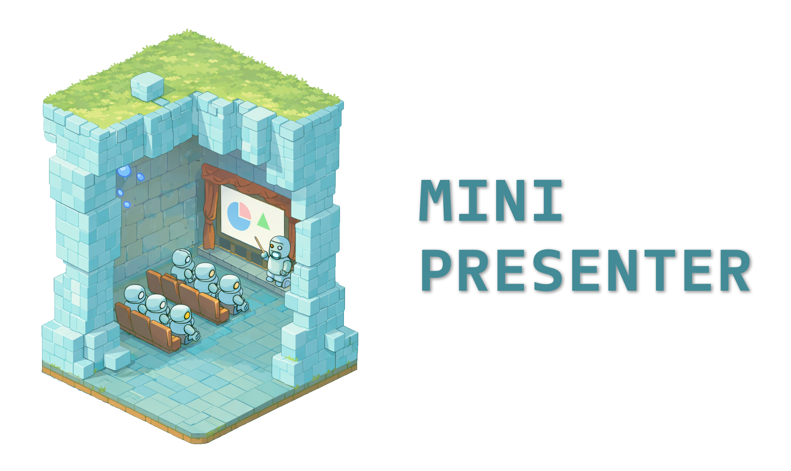
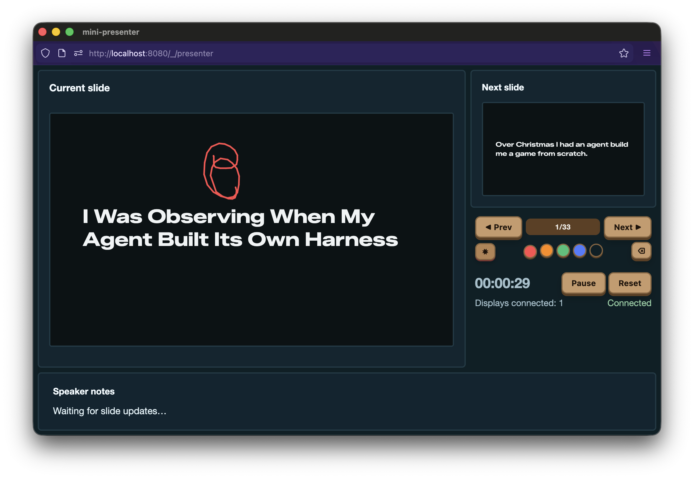

# mini-presenter

<div align="center">
  
</div>

mini-presenter is a tiny local server that injects a display helper into your
slides and provides a presenter view with timers, notes, and previews.

<div align="center">
  
</div>

This should allow you to present almost any website as a slideshow for as long
as it has anchors per slide and build step.  With a bit of extra support for
special marker hashes you can also have next slide previews.

## Features

- Injected display script keeps the presenter view in sync.
- Presenter dashboard with current slide preview, timer, and connection status.
- Built-in laser pointer and drawing tools.
- Optional next-slide preview when your deck exposes slide order.
- Speaker notes via deck API or Markdown files.
- Configurable keyboard shortcuts.
- Optional file watching with auto-reload.
- Optional Cloudflare tunnel via `cloudflared` for sharing previews.

## Installation

```bash
# Run directly with npx (no install needed)
npx mini-presenter path/to/deck

# Or install globally
npm install -g mini-presenter
```

## Quick start

```bash
npx mini-presenter path/to/deck --port 8080 --watch --funnel
npx mini-presenter https://mitsuhiko.github.io/talks/i-was-questioning-life/
```

- Slides: `http://localhost:8080/`
- Presenter view: `http://localhost:8080/_/presenter`

When you pass a URL, mini-presenter proxies the remote site through the local server. File watching is only available for local folders.

Use `--watch` to enable file watching and auto-reload on HTML/CSS/JS changes.
Use `--funnel` to create an anonymous Cloudflare tunnel (requires `cloudflared`).

## Export slides (PDF/PNG)

The exporter will start a dedicated Chrome instance with remote debugging automatically.

```bash
npx mini-presenter export ./slides --output slides.pdf
npx mini-presenter export ./slides --output ./images --format png --delay 500
```

## Basic requirements for slide decks

Your presentation can be plain HTML/CSS/JS as long as it cooperates with navigation and state reporting:

- **Served from a local folder or URL.** mini-presenter serves the folder or proxies the URL you pass on the CLI and injects its script into any HTML file.
- **Expose a current slide identifier.** The injected script uses `window.miniPresenter.getCurrentSlide()` if available. Otherwise it falls back to `location.hash`.
- **React to navigation commands.** The presenter sends `next`, `prev`, `first`, `last`, and `goto` actions. Implement the mini-presenter API (below) _or_ listen for keyboard events (`ArrowRight`, `ArrowLeft`, `Home`, `End`) and update the slide state yourself.
- **Update the URL hash.** This is the easiest way to keep the presenter preview and notes aligned. When the current slide changes, update `location.hash` (or implement `getCurrentSlide()`).

If you already have a deck that uses hash-based navigation (Reveal, custom HTML, etc.), it usually “just works.”

## Mini-presenter deck API (optional)

Add a global `window.miniPresenter` object to make the presenter smarter:

```js
window.miniPresenter = {
  // Navigation hooks (used instead of keyboard events when present)
  next() {},
  prev() {},
  first() {},
  last() {},
  goto(hash) {},

  // State + metadata
  getCurrentSlide() { return location.hash || "#"; },
  getSlideList() { return ["#1", "#2", "#3"]; },
  getNotes(slideId) { return "Speaker notes"; }
};
```

- `getSlideList()` enables the next-slide preview.
- `getNotes(slideId)` provides speaker notes directly from the deck.
- If you don’t expose these hooks, the presenter falls back to URL hash updates and keyboard events.

## Presenter preview context
The presenter view loads slide previews in iframes with `?_presenter_preview=1`.
When that query param is present, the injected script:
- sets `window.miniPresenter.isPresenterPreview = true`
- sets `document.documentElement.dataset.presenterPreview = "true"`
- mutes all `<audio>`/`<video>` elements so previews stay silent

Use this flag to disable autoplay audio or heavyweight effects in the presenter view.

## Configuration (`presenter.json`)

Place an optional `presenter.json` next to your `index.html` to customize the presenter experience.

```json
{
  "title": "My Presentation",
  "keyboard": {
    "next": ["ArrowRight", "Space", "PageDown", "l", "j"],
    "prev": ["ArrowLeft", "PageUp", "h", "k"],
    "first": ["Home"],
    "last": ["End"]
  },
  "notes": {
    "source": "files"
  },
  "preview": {
    "relativeHash": true
  },
  "timer": {
    "mode": "countdown",
    "durationMinutes": 30
  },
  "draw": {
    "color": "#ff4d4d",
    "size": 0.004
  },
  "laser": {
    "color": "#ffdd4d",
    "size": 0.012
  }
}
```

- `title`: Optional presenter title (defaults to the slideshow `<title>`).
- `keyboard`: Custom key bindings for presenter navigation.
- `notes.source`: `api`, `files`, or `none` (default: `api` + file fallback).
- `preview.relativeHash`: Enable `#<hash>~next` preview resolution.
- `timer.mode`: `countup` (default) or `countdown`.
- `timer.durationMinutes` / `timer.durationSeconds`: Total countdown duration.
  The countdown starts after leaving the first slide and can be started manually
  with the presenter timer button.
- `draw.color` / `draw.size`: Defaults for drawing color and size (ratio of slide width).
- `laser.color` / `laser.size`: Defaults for laser color and size (ratio of slide width).

The config is available at `/_/api/config`.

## Speaker notes

Notes are shown in the presenter view and loaded in this order:

1. Presentation API: define `window.miniPresenter.getNotes(slideId)` in your deck.
2. Notes files: add Markdown files under `notes/` next to your `index.html`.

File mapping rules:

- `#1` → `notes/1.md`
- `#1.2` → `notes/1.2.md` (falls back to `notes/1.md` if missing)
- `#2-1` → `notes/2-1.md` (falls back to `notes/2.md` if missing)
- `#/2/1` → `notes/2--1.md` (slashes become `--`)
- `#intro` → `notes/intro.md`

Numeric hashes with `-`, `.`, or `--` suffixes fall back to the base number if the
specific file is missing (for example `#2/1` → `notes/2.md`).

Notes are fetched from `/_/api/notes?hash=%23intro` and rendered as pre-wrapped text.

## Next slide preview

The presenter shows a next-slide preview when it can determine the slide order from
`window.miniPresenter.getSlideList()` in your deck (returns an array of hashes).

If `preview.relativeHash` is enabled, the preview iframe loads `#<hash>~next` and expects
slide logic in your deck to resolve it to the next state (including build steps).

## AI Use Disclaimer

**Note:** this library was 100% AI generated with Pi. I will try to fix
it up as good as possible as I ran into issues, but I cannot vouch for the
quality of it.

## License and Links

- [Issue Tracker](https://github.com/mitsuhiko/mini-presenter/issues)
- [Discussions](https://github.com/mitsuhiko/mini-presenter/discussions)
- License: [Apache-2.0](https://github.com/mitsuhiko/mini-presenter/blob/main/LICENSE)
