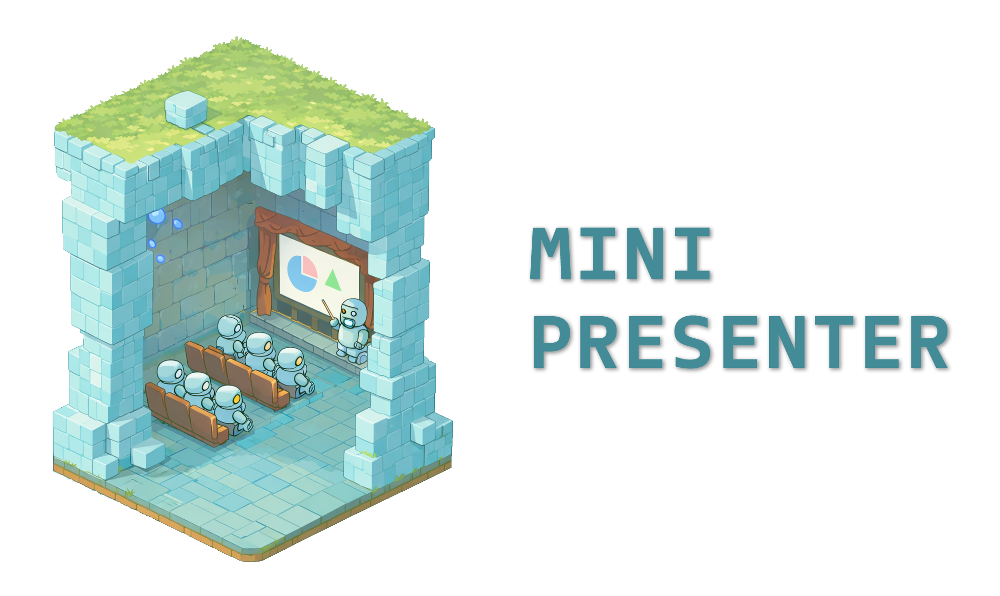
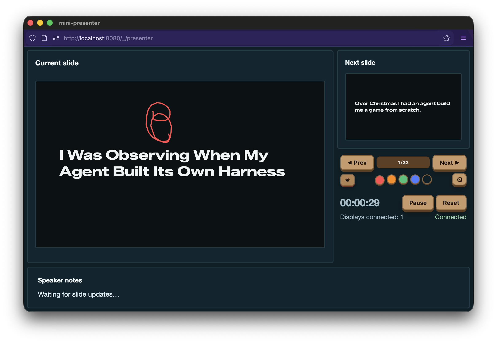

# mini-presenter

<div align="center">
  
</div>

mini-presenter is a tiny local server that injects a display helper into your
slides and provides a presenter view with timers, notes, and previews.

<div align="center">
  
</div>

This should allow you to present almost any website as a slideshow for as long
as it has anchors per slide and build step.  With a bit of extra support for
special marker hashes you can also have next slide previews.

## Features

- Injected display script keeps the presenter view in sync.
- Presenter dashboard with current slide preview, timer, and connection status.
- Built-in laser pointer and drawing tools.
- Audience Q&A page with live updates and QR sharing.
- Presenter recording (slide events + audio) with playback for local decks.
- Optional next-slide preview when your deck exposes slide order.
- Speaker notes via deck API or Markdown files, with optional `@speaker:` tags.
- Configurable keyboard shortcuts.
- Optional file watching with auto-reload.
- Optional Cloudflare tunnel via `cloudflared` for sharing previews.

## Installation

```bash
# Run directly with npx (no install needed)
npx mini-presenter path/to/deck

# Or install globally
npm install -g mini-presenter
```

## Quick Start

```bash
npx mini-presenter path/to/deck --port 8080 --watch --funnel
npx mini-presenter https://mitsuhiko.github.io/talks/i-was-questioning-life/
```

- Slides: `http://localhost:8080/`
- Presenter view: `http://localhost:8080/_/presenter`

When you pass a URL, mini-presenter proxies the remote site through the local server. File watching is only available for local folders.

Use `--watch` to enable file watching and auto-reload on HTML/CSS/JS changes.
Use `--funnel` to create an anonymous Cloudflare tunnel (requires `cloudflared`).

## Standalone Local Mode (No Node Server)

For static/CDN decks, you can use a local-tab mode that avoids the server completely.
Include the standalone bootstrap in your deck HTML:

```html
<script src="https://cdn.jsdelivr.net/gh/mitsuhiko/mini-presenter@main/client/standalone.js"></script>
```

This enables presenter control over local tabs using `BroadcastChannel` with a
`postMessage`/`MessageChannel` fallback. The presenter opens from
`presenter-standalone.html` and communicates directly with the slide tab.

In local mode, the display will use deck-provided config from
`window.miniPresenter.getConfig()` / `window.miniPresenter.config` when
available, and otherwise tries to load `presenter.json` next to the deck page.

When the same deck is served through normal `mini-presenter` server mode,
`standalone.js` auto-detects that environment and becomes a no-op.

### Capability Matrix

| Feature | Server mode | Local mode |
|---|---:|---:|
| Slide control + sync | ✅ | ✅ |
| Current preview | ✅ | ✅ |
| Next preview | ✅ | ✅* |
| Draw / laser | ✅ | ✅ |
| Timer | ✅ | ✅ |
| `notes/*.md` file loading | ✅ | ❌ |
| Q&A | ✅ | ❌ |
| Export API | ✅ | ❌ |
| Recording persistence | ✅ | ❌ |
| Save `presenter.json` | ✅ | ❌ |

\*Next preview works best when presenter and deck are same-origin and the deck
exposes `getSlideList()`/relative hash support.

### Enter Presenter Mode

- **Server mode:** `npx mini-presenter ./slides`
  - open `/` and `/_/presenter`
  - verify navigation, draw/laser, notes, export, questions, recording save, config save
- **Local mode:** static deck + `standalone.js`
  - open presenter from in-slide shortcut/button
  - verify navigation sync, previews, draw/laser, timer
  - verify server-only actions are disabled and labeled accordingly

## Export Slides (PDF/PNG)

The exporter will start a dedicated Chrome instance with remote debugging automatically.

```bash
npx mini-presenter export ./slides --output slides.pdf
npx mini-presenter export ./slides --output ./images --format png --delay 500
```

## Basic Requirements for Slide Decks

Your presentation can be plain HTML/CSS/JS as long as it cooperates with navigation and state reporting:

- **Served from a local folder or URL.** mini-presenter serves the folder or proxies the URL you pass on the CLI and injects its script into any HTML file.
- **Expose a current slide identifier.** The injected script uses `window.miniPresenter.getCurrentSlide()` if available. Otherwise it falls back to `location.hash`.
- **React to navigation commands.** The presenter sends `next`, `prev`, `first`, `last`, and `goto` actions. Implement the mini-presenter API (below) _or_ listen for keyboard events (`ArrowRight`, `ArrowLeft`, `Home`, `End`) and update the slide state yourself.
- **Update the URL hash.** This is the easiest way to keep the presenter preview and notes aligned. When the current slide changes, update `location.hash` (or implement `getCurrentSlide()`).

If you already have a deck that uses hash-based navigation (Reveal, custom HTML, etc.), it usually “just works.”

## mini-presenter Deck API (Optional)

Add a global `window.miniPresenter` object to make the presenter smarter:

```js
window.miniPresenter = {
  // Navigation hooks (used instead of keyboard events when present)
  next() {},
  prev() {},
  first() {},
  last() {},
  goto(hash) {},

  // State + metadata
  getCurrentSlide() { return location.hash || "#"; },
  getSlideList() { return ["#1", "#2", "#3"]; },
  getNotes(slideId) { return "Speaker notes"; }
};
```

- `getSlideList()` enables the next-slide preview.
- `getNotes(slideId)` provides speaker notes directly from the deck (including optional `@name:` speaker markers).
- If you don’t expose these hooks, the presenter falls back to URL hash updates and keyboard events.

## Presenter Preview Context
The presenter view loads slide previews in iframes with `?_presenter_preview=1`.
When that query param is present, the injected script:
- sets `window.miniPresenter.isPresenterPreview = true`
- sets `document.documentElement.dataset.presenterPreview = "true"`
- mutes all `<audio>`/`<video>` elements so previews stay silent

Use this flag to disable autoplay audio or heavyweight effects in the presenter view.

## Configuration (`presenter.json`)

Place an optional `presenter.json` next to your `index.html` to customize the presenter experience.

```json
{
  "title": "My Presentation",
  "keyboard": {
    "next": ["ArrowRight", "Space", "PageDown", "l", "j"],
    "prev": ["ArrowLeft", "PageUp", "h", "k"],
    "first": ["Home"],
    "last": ["End"]
  },
  "shortcuts": {
    "fullscreen": ["f"],
    "presenter": ["p"],
    "questions": ["q"],
    "recording": ["Shift+R"]
  },
  "notes": {
    "source": "files"
  },
  "preview": {
    "relativeHash": true
  },
  "timer": {
    "mode": "countdown-slide",
    "transitionSeconds": 2,
    "durationMinutes": 30,
    "slides": {
      "#intro": 20,
      "#agenda": 45,
      "#demo": 180
    }
  },
  "draw": {
    "color": "#ff4d4d",
    "size": 0.004
  },
  "laser": {
    "color": "#ffdd4d",
    "size": 0.012
  },
  "recording": {
    "deviceId": "default"
  }
}
```

- `title`: Optional presenter title (defaults to the slideshow `<title>`).
- `keyboard`: Custom key bindings for presenter navigation.
- `shortcuts`: Presenter shortcuts for fullscreen, presenter view, questions, and recording.
- `notes.source`: `api`, `files`, or `none` (default: `api` + file fallback).
- `preview.relativeHash`: Enable `#<hash>~next` preview resolution.
- `timer.mode`: `countup` (default), `countdown-total`, or `countdown-slide`.
  `countdown` is still accepted as an alias for `countdown-total`.
- `timer.durationMinutes` / `timer.durationSeconds`: Explicit total countdown duration.
  If omitted in `countdown-slide` mode, the total is derived from all known
  slide durations plus transition time between slides.
- `timer.slides`: Optional per-slide duration map in **seconds**.
  Keys are slide hashes (for example `#intro`, `#2`, `#2.1`).
- `timer.transitionSeconds`: Transition time added between slides when deriving
  the total countdown (default: `2`).
- `timer.defaultSlideSeconds`: Optional fallback duration for slides without an
  explicit time.

For countdown modes, the timer is armed on the first slide and starts
automatically after advancing to the second slide. You can also start it
manually with the timer button.

Per-slide times can also be read from your deck HTML using `data-slide-time`.
Use seconds (`"45"`) or `MM:SS` / `HH:MM:SS` (for example `"1:30"`):

```html
<section id="intro" data-slide-time="20"></section>
<section id="demo" data-slide-time="1:30"></section>
```

Elements can be matched by `id`, `data-slide-id`, or `data-slide-hash`.
- `draw.color` / `draw.size`: Defaults for drawing color and size (ratio of slide width).
- `laser.color` / `laser.size`: Defaults for laser color and size (ratio of slide width).
- `recording.deviceId`: Optional audio input device id (set in presenter settings).

The config is available at `/_/api/config`.

## Speaker Notes

Notes are shown in the presenter view and loaded in this order:

1. Presentation API: define `window.miniPresenter.getNotes(slideId)` in your deck.
2. Notes files: add Markdown files under `notes/` next to your `index.html`.

File mapping rules:

- `#1` → `notes/1.md`
- `#1.2` → `notes/1.2.md` (falls back to `notes/1.md` if missing)
- `#2-1` → `notes/2-1.md` (falls back to `notes/2.md` if missing)
- `#/2/1` → `notes/2--1.md` (slashes become `--`)
- `#intro` → `notes/intro.md`

Numeric hashes with `-`, `.`, or `--` suffixes fall back to the base number if the
specific file is missing (for example `#2/1` → `notes/2.md`).

Notes are fetched from `/_/api/notes?hash=%23intro` and rendered as pre-wrapped text.

### Speaker Markers in Notes

You can mark speakers directly in notes with lines that start with `@name:`:

```md
@alice:
Intro and framing

@bob:
Live demo
```

- The first `@name:` on a slide is treated as the active speaker.
- Additional `@name:` markers are treated as additional speakers for that slide.
- Speaker tags are highlighted in color in the presenter notes panel.
- If a slide has no `@name:` marker, the previous slide's speaker carries on.

## Audience Questions (Q&A)

Audience members can submit and vote on questions at:

- `/_/questions` — live Q&A page
- `/_/questions/qr` — QR code landing page (handy with `--funnel`)

In the presenter view, press `q` (or click the questions badge) to open the live
questions panel, refresh, and mark questions as answered.

## Recording and Playback

Use the record button (default shortcut: `Shift+R`) in the presenter view to capture
slide navigation, laser/draw actions, and microphone audio. Recordings are stored as
`recording.json` + `recording.webm` next to your local deck and can be replayed from
the presenter view via the play button. Recording is only available for local folders.

## Next Slide Preview

The presenter shows a next-slide preview when it can determine the slide order from
`window.miniPresenter.getSlideList()` in your deck (returns an array of hashes).

If `preview.relativeHash` is enabled, the preview iframe loads `#<hash>~next` and expects
slide logic in your deck to resolve it to the next state (including build steps).

When speaker markers are present in notes, the next-slide card also shows:
- the first speaker on the next slide
- any additional speakers on that slide

If the next slide has no `@name:` marker, the current speaker is carried over.

## AI Use Disclaimer

**Note:** this library was 100% AI generated with Pi. I will try to fix
it up as good as possible as I ran into issues, but I cannot vouch for the
quality of it.

## License and Links

- [Issue Tracker](https://github.com/mitsuhiko/mini-presenter/issues)
- [Discussions](https://github.com/mitsuhiko/mini-presenter/discussions)
- License: [Apache-2.0](https://github.com/mitsuhiko/mini-presenter/blob/main/LICENSE)
